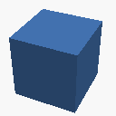

# openscad-actions

## Introduction

There are three actions:

  - **build**: Builds [OpenSCAD](https://openscad.org) models and images from a
    git repository using make.
  - **update-media-artifacts**: Checks-in the artifacts (STLs, images, etc..) to
    an orphan "media" branch of a git repository.
  - **annotate-models**: Expands special model-related tags in markdown files.

## Actions

### build

The **build** action is straight forward with the only real "trick" being an
option the use of Xvfb. An X server is necessary for OpenSCAD to capture images.
So, roughly, the **build** action is:

  - *Checkout source* →
  - *Install OpenSCAD, optionally Xvfb, and any extra packages* →
  - *Build with "<command> <targets>" optionally under Xvfb (xvfb-run)*

The parameters of the **build** action are:

| Name                      | Type    | Default            | Description                                            |
| ------------------------- | ------- | ------------------ | ------------------------------------------------------ |
| targets                   | string  | 'all'              | Build target(s) supplied to the command                |
| command                   | string  | 'make -j $(nproc)' | Build command itself                                   |
| extra\_packages           | string  | ''                 | List of extra packages to install                      |
| use\_xvfb                 | boolean | false              | Run the build under Xvfb                               |
| check\_targets            | boolean | false              | Check if the _targets_ string is empty and fail if so  |
| local\_libraries          | boolean | false              | Build target local-libraries and set OPENSCADPATH env  |

### update-media-artifacts

The **update-media-artifacts** action is built on the idea of using an orphan
branch of a repository to store images and other built artifacts (described
[here](https://medium.com/@minamimunakata/how-to-store-images-for-use-in-readme-md-on-github-9fb54256e951)).
In addition to the separate branch, the action allows the built artifacts to be
moved into a separate subdirectory. So the **update-media-artifacts** action is:

  - *Switch to media branch, leaving built artifacts (i.e. checkout with no clean)* →
  - *Remove everything except built artifacts matching specified extensions* →
  - *Remove everything any addition artifacts (optional)* →
  - *Move all artifacts to a separate subdirectory (optional)* →
  - *Checkin the artifacts*

The parameters of the **update-media-artifacts** action are:

| Name                        | Type    | Default                       | Description                                                 |
| --------------------------- | ------- | ----------------------------- | ----------------------------------------------------------- |
| message                     | string  | 'Update media'                | Message used when committing artifacts                      |
| files                       | string  | 'png stl off amf 3mf dxf svg' | Extensions of files to be committed                         |
| files\_except               | string  | ''                            | Files (or glob) to be removed after build and before commit |
| media\_branch               | string  | 'media'                       | Orphan branch name (as described in the article)            |
| media\_subdirectory         | string  | 'media'                       | Subdirectory to which all files are moved                   |
| media\_create\_subdirectory | boolean | true                          | Create the media subdirectory if it doesn't exist           |
| dry\_run                    | boolean | false                         | Do everything but use --dry-run on the final push           |
| user\_name                  | string  | 'github-actions'              | User name used when committing artifacts                    |
| user\_email                 | string  | 'github-actions@github.com'   | Email address used when committing artifacts                |

### annotate-models 

The **annotate-models** action is a very specialized action used to expand
content within a markdown file. It adds links to STL and image files. The
**annotate-models** action is:

  - *For each file to expand* →
  - *Search the file for special \<div class="model" ...\> HTML tags* →
  - *Expand the contents of the special \<div\> tags* →
  - *Checkin the file if changed*

The *magic* is that the special *div* tags can have the following special
attributes that are expanded to HTML tables. The attributes are:

| Attribute         | Value                                                             |
| ----------------- | ----------------------------------------------------------------- |
| data-name         | Name of model (used in alt text, tips, etc.)                      |
| data-icon-size    | Icon size (default 96)                                            |
| data-desc-width   | Description width - number or auto (default auto)                 |
| data-cell-padding | Margin around cells (default 16 - imposed externally)             |
| data-left         | Left link                                                         |
| data-left-icon    | Icon image for left link (optional, will use link resized)        |
| data-left-desc    | Name for left link (optional, default '_data-name_ Model')        |
| data-right        | Right link                                                        |
| data-right-icon   | Icon Image for right link (optional, will use image resized)      |
| data-right-desc   | Name for right link (optional, default '_data-name_ Installed')   |

The simple markdown/HTML combination:
```html
  <div class="model" data-name="Thing" data-left="examples/thing.stl" data-left-icon="examples/thing.icon.png" data-right="examples/thing.full.png">

    **THIS** is a *thing* (with markdown highlighting expanded)

  </div>
```
can be expanded to a centered 3-cell table that looks like this:

<div class="model" data-name="Thing" data-left="examples/thing.stl" data-left-icon="examples/thing.icon.png" data-right="examples/thing.full.png"><!-- expanded by annotate-model --><table align="center" width="100%"><tbody><tr width="100%"><td align="center" width="128" height="128"><a href="examples/thing.stl" target="_blank" title="View Thing Model"></a></td><td>

**THIS** is a *thing* (with markdown highlighting expanded)

</td><td align="center" width="128" height="128"><a href="examples/thing.full.png" target="_blank" title="View Thing Installed"></a></td></tr></tbody></table></div>

The parameters of the **annotate-models** action are:

| Name                        | Type    | Default                       | Description                                                 |
| --------------------------- | ------- | ----------------------------- | ----------------------------------------------------------- |
| file                        | string  | 'README.md'                   | File to be processed                                        |
| message                     | string  | 'Expand models'               | Message used when committing updated files                  |
| class\_name                 | string  | 'model'                       | Class attribute value on \<div class= to search for         |
| image\_path                 | string  | '../media/media'              | URI to prepend to images                                    |
| link\_path                  | string  | '../media/media'              | URI to prepend to links                                     |
| extra\_parameters           | string  | ''                            | Extra parameters to pass to the annotator script            |
| dry\_run                    | boolean | false                         | Do everything but use --dry-run on the final push           |
| user\_name                  | string  | 'github-actions'              | User name used when committing artifacts                    |
| user\_email                 | string  | 'github-actions@github.com'   | Email address used when committing artifacts                |

## Examples

### Update Media

Combines two actions to update media icons, images, and STL. This uses the
target option of the **build** action to make special targets and then uses the
**update-media-artifacts** action to check-in those files:

```yaml
  name: 'Update Media'

  on:
    workflow_dispatch: 

  jobs:
    build:
      runs-on: ubuntu-latest
      - name: Build Media
        uses: swthemathwiz/openscad-actions/build@v1
        with:
          target: 'all icons images'
          use_xvfb: true
      - name: Update Media
        uses: swthemathwiz/openscad-actions/update-media-artifacts@v1
        with:
          message: 'Update media'
          files: 'png stl'
          media_branch: 'media'
          media_subdirectory: 'media'
```

### Release with STLs

Combine a version tag/push trigger with the **build** action to create a github
release (using action [softprops/action-gh-release](https://github.com/softprops/action-gh-release))
that includes built STL files: 

```yaml
  name: 'Release with STLs'

  on:
    push:
      tags:
        - "v*"

  jobs:
    build:
      runs-on: ubuntu-latest
      steps:
      - name: Build
        uses: swthemathwiz/openscad-action/build@v1
      - name: Release
        uses: softprops/action-gh-release@v2
        with:
          body: New Release
          files: '*.stl'
          generate_release_notes: true
```

### Annotate README.md

Use a file push trigger with the **annotate-models** action to expand the
README.md file whenever it is pushed:

```yaml
  name: 'Annotate README.md'

  on:
    push:
      paths:
        - 'README.md'

  jobs:
    build:
      runs-on: ubuntu-latest
      steps:
      - name: Annotate README.md
        uses: swthemathwiz/openscad/annotate-models@v1
        with:
          file: 'README.md'
```
